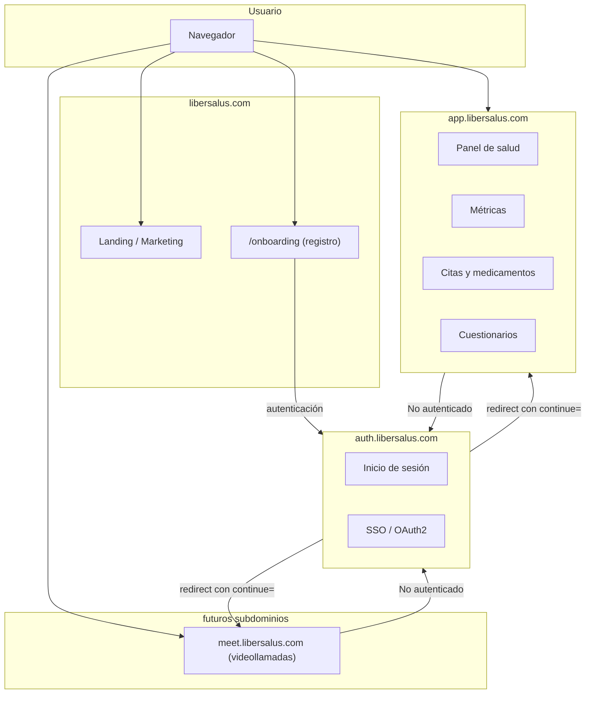

# Libersalus

Ecosistema de salud digital — PWA para gestión de salud, métricas, citas, medicamentos y bienestar.

## Estado actual

Actualmente el login y el panel están acoplados en un mismo monolito frontend. La meta es separarlos en subdominios independientes.

## Arquitectura objetivo (micro-frontends)



## Flujo de autenticación (SSO)

1. El usuario entra a cualquier subdominio (`app`, `meet`, etc.) o a `/onboarding` en el dominio principal
2. Si no tiene sesión, se redirige a `auth.libersalus.com?continue=https://origen.ruta`
3. Inicia sesión en auth
4. Auth redirige de vuelta a la URL original en `continue`
5. El subdominio recibe un token/cookie y carga la app

Esto permite añadir nuevas apps (videollamadas, foros, etc.) sin replicar lógica de autenticación.

## Stack actual

- React + Vite
- React Router
- MUI (Material UI)
- Recharts
- Day.js
- vite-plugin-pwa
- vite-plugin-svgr

## Comandos

```bash
npm run dev       # servidor de desarrollo
npm run build     # build producción
npm run preview   # previsualizar build
```

## Variables de entorno (`.env`)

| Variable | Descripción | Ejemplo |
|---|---|---|
| `VITE_API` | URL base del backend | `https://libersalus.com/api/` |
| `VITE_BASE` | Ruta base de la app | `/panel/` |
| `VITE_DEMO` | Modo demo totalmente offline (sin backend) | `true` o `false` |
| `VITE_DEMO_USER` | Correo del usuario demo (default `demo@libersalus.com`) | `demo@libersalus.com` |
| `VITE_DEMO_PASSWORD` | Contraseña del usuario demo (default `Demo1234`) | `Demo1234` |
| `VITE_LOGIN_URL` | Ruta de login | `/panel/login` |

## Arquitectura actual del código

```
src/
├── components/       # Header, Footer, layout
├── config/           # rutas, constantes
├── features/         # módulos por funcionalidad
│   ├── autenticacion/
│   └── metricas/
├── hooks/            # hooks compartidos
├── pages/            # páginas del dashboard
├── routes/           # definición de rutas
├── services/         # API, auth, perfil
└── shared/           # assets, utilerías
```

## PWA

- `display: standalone` — se instala como app nativa
- Service worker con precaching y cacheo de API
- Notificaciones al instalar y al iniciar sesión

## Qué aporta el service worker (vs. una web sin él)

| Capacidad | Sin service worker | Con service worker |
|---|---|---|
| Offline | Pantalla blanca o error | App funcional con datos cacheados |
| Cachear API | Solo con librerías externas | Estrategia configurable (NetworkFirst, CacheFirst, etc.) |
| Notificaciones push | No disponibles | Push desde backend aunque el usuario no esté en la app |
| Sincronización en segundo plano | Imposible | Registrar tareas pendientes (ej. guardar métricas sin conexión) |
| Actualización silenciosa | Requiere recargar página | Service worker descarga y actualiza en background |
| Precarga de assets | Bajo demanda, más lentos | Precargados en la instalación inicial |

## Push Notifications en PWAs

### Qué son

Permiten que un backend envíe mensajes a la PWA incluso cuando la app está cerrada, el navegador no está abierto o el dispositivo está bloqueado. Funcionan mediante Service Workers, Push API, Notification API y la infraestructura push del navegador (FCM / APNS / Mozilla Push).

### Arquitectura

```
Backend → Push Service (Google/Apple/Mozilla) → Browser → Service Worker → Notification UI
```

### Componentes

| Componente | Rol |
|---|---|
| Frontend PWA | Solicita permisos y registra la suscripción push |
| Service Worker | Proceso background que recibe eventos push y muestra notificaciones sin la app abierta |
| Push Service | Infraestructura del navegador (Chrome → FCM, Firefox → Mozilla Push, Safari → APNS). El backend nunca se comunica directamente con el dispositivo |
| Backend | Guarda subscriptions, decide cuándo enviar pushes y envía payloads mediante Web Push Protocol |

### Flujo completo

1. **Registrar Service Worker** — `navigator.serviceWorker.register('/sw.js')`
2. **Solicitar permisos** — `Notification.requestPermission()`
3. **Crear subscription** — `registration.pushManager.subscribe(...)` genera `{ endpoint, keys: { p256dh, auth } }`
4. **Enviar subscription al backend** — guarda endpoint, auth, p256dh y user_id
5. **Backend envía push** — usando `web-push` (Node.js) o `pywebpush` (Python)
6. **Push Service entrega mensaje** — el navegador recibe el push y despierta el Service Worker
7. **Service Worker muestra notificación** — `self.registration.showNotification(...)`

### Características clave

- **Funciona con app cerrada** — el navegador despierta el Service Worker automáticamente
- **Requiere internet** — necesita conexión para recibir el mensaje
- **Almacenamiento temporal** — el Push Service guarda el mensaje mientras el usuario está offline (no es permanente)
- **TTL (Time To Live)** — define cuánto tiempo conservar el push (ej. 3600s, máximo 28 días)
- **No garantiza entrega** — los pushes pueden perderse, expirar, retrasarse o ser descartados
- **Payload cifrado** — Web Push cifra usando p256dh y auth keys
- **HTTPS obligatorio** — solo localhost es excepción

### Diferencia con WebSocket

| WebSocket | Push |
|---|---|
| Conexión persistente | Sin conexión persistente |
| Bidireccional | Orientado a eventos |
| Realtime continuo | Puede despertar apps cerradas |

### Casos de uso

**Adecuados:** mensajes offline, alertas, recordatorios, promociones, updates importantes.

**No adecuados:** gaming realtime, colaboración live, streaming continuo, trading de baja latencia.

### Arquitectura recomendada

La base de datos del backend es la fuente real de verdad; la push es una señal temporal que indica "tienes nuevos datos". Luego la app sincroniza desde API.

### Debugging

Chrome DevTools → Application → Service Workers: inspeccionar workers, ver cache, probar pushes, revisar logs.

### Limitaciones

- **iOS:** Push en PWAs disponible desde iOS 16.4+, requiere "Add to Home Screen" y Safari/WebKit.

### Librerías comunes

- **Frontend:** Workbox, vite-plugin-pwa
- **Backend:** pywebpush, web-push, Firebase Admin SDK

### Resumen

Push Notifications permiten comunicación backend → usuario mediante Service Workers y Push Services del navegador. Son ideales para alertas y eventos offline, pero no reemplazan bases de datos, colas persistentes ni WebSockets realtime.

## Historial

### Limpieza ya realizada

- Se movieron a `afuera/` carpetas, assets y piezas legacy sin referencias activas (graficas viejas, `backgroundPanel`, config de metricas antiguas, PDF de metricas, tarjeta bienestar, paginas placeholder).
- Se centralizo el avatar default en `src/shared/assets/images/perfil/usuario-default.png`.
- Se creo `PaginaEnConstruccion` para pantallas temporales reutilizables.

### Commits recientes

- `30d6651` Conecta graficas de oxigenacion y glucosa.
- `eced4f6` Ordena archivos legacy fuera del arbol activo.
- `4f25f4` Mueve paginas placeholder fuera del arbol activo.
- `8b0a685` Actualiza avatar compartido y jsconfig.
- `66a2eb7` Mueve tarjeta bienestar sin uso activo.
- `f801e38` Mueve piezas de metricas sin uso activo.
- `7fef2a5` Mueve assets de metricas sin uso activo.
- `df12adc` Mueve documento pdf de metricas sin uso activo.
- `017a4c7` Reutiliza pantalla temporal en rutas pendientes.
