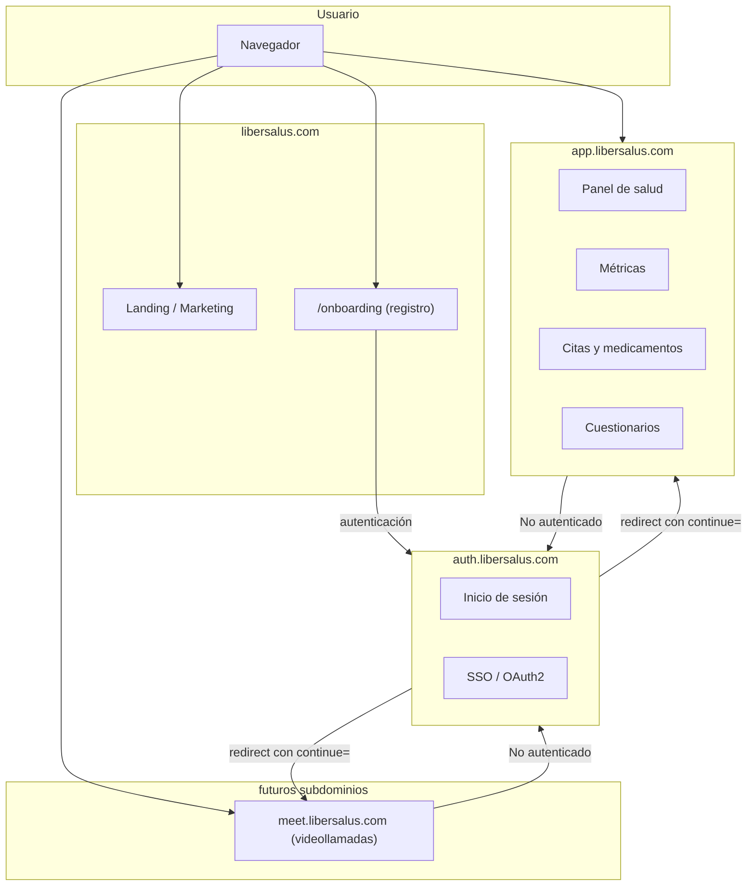

# Libersalus

Ecosistema de salud digital — PWA para gestión de salud, métricas, citas, medicamentos y bienestar.

## Estado actual

Actualmente el login y el panel están acoplados en un mismo monolito frontend. La meta es separarlos en subdominios independientes.

## Arquitectura objetivo (micro-frontends)



## Flujo de autenticación (SSO)

1. El usuario entra a cualquier subdominio (`app`, `meet`, etc.) o a `/onboarding` en el dominio principal
2. Si no tiene sesión, se redirige a `auth.libersalus.com?continue=https://origen.ruta`
3. Inicia sesión en auth
4. Auth redirige de vuelta a la URL original en `continue`
5. El subdominio recibe un token/cookie y carga la app

Esto permite añadir nuevas apps (videollamadas, foros, etc.) sin replicar lógica de autenticación.

## Stack actual

- React + Vite
- React Router
- MUI (Material UI)
- Recharts
- Day.js
- vite-plugin-pwa
- vite-plugin-svgr

## Comandos

```bash
npm run dev       # servidor de desarrollo
npm run build     # build producción
npm run preview   # previsualizar build
```

## Variables de entorno (`.env`)

| Variable | Descripción | Ejemplo |
|---|---|---|
| `VITE_API` | URL base del backend | `https://libersalus.com/api/` |
| `VITE_BASE` | Ruta base de la app | `/panel/` |
| `VITE_MOCK_AUTH` | Modo desarrollo sin backend | `0` o `1` |
| `VITE_LOGIN_URL` | Ruta de login | `/panel/login` |

## Arquitectura actual del código

```
src/
├── components/       # Header, Footer, layout
├── config/           # rutas, constantes
├── features/         # módulos por funcionalidad
│   ├── autenticacion/
│   └── metricas/
├── hooks/            # hooks compartidos
├── pages/            # páginas del dashboard
├── routes/           # definición de rutas
├── services/         # API, auth, perfil
└── shared/           # assets, utilerías
```

## PWA

- `display: standalone` — se instala como app nativa
- Service worker con precaching y cacheo de API
- Notificaciones al instalar y al iniciar sesión

## Qué aporta el service worker (vs. una web sin él)

| Capacidad | Sin service worker | Con service worker |
|---|---|---|
| Offline | Pantalla blanca o error | App funcional con datos cacheados |
| Cachear API | Solo con librerías externas | Estrategia configurable (NetworkFirst, CacheFirst, etc.) |
| Notificaciones push | No disponibles | Push desde backend aunque el usuario no esté en la app |
| Sincronización en segundo plano | Imposible | Registrar tareas pendientes (ej. guardar métricas sin conexión) |
| Actualización silenciosa | Requiere recargar página | Service worker descarga y actualiza en background |
| Precarga de assets | Bajo demanda, más lentos | Precargados en la instalación inicial |
