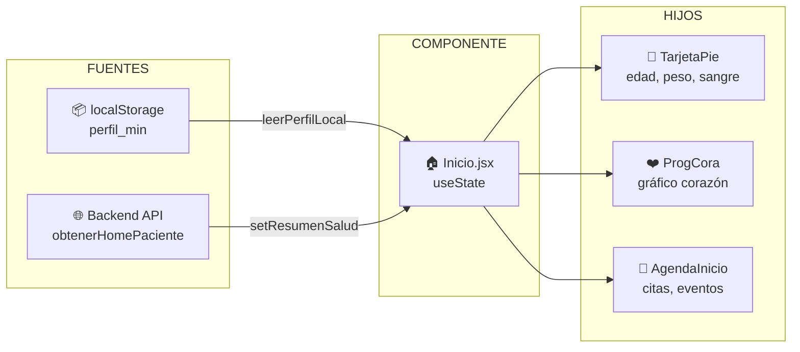

# Arquitectura UI — Home (Dashboard del Paciente)

> Pantalla principal que el usuario ve después de autenticarse.  
> Componente raíz: `src/pages/Inicio/Inicio.jsx`

---

## Estructura de Componentes

```
Inicio
├── Sos                              ← Botón de emergencia (flotante)
│
├── .seccSuperior                    ← Sección superior (2 columnas)
│   ├── .cntMono                     ← Card Avatar (columna izquierda)
│   │   ├── h2.saludo                ← "Hola, {nombre}"
│   │   ├── img.cuadro               ← Marco decorativo
│   │   ├── img.mancha               ← Mancha de color (varía por sexo)
│   │   ├── img.mono                 ← Avatar del paciente
│   │   │
│   │   ├── TarjetaPie               ← Datos generales del paciente
│   │   │   ├── Edad
│   │   │   ├── Estatura
│   │   │   ├── Peso
│   │   │   └── Tipo de sangre
│   │   │
│   │   └── .cntCora                 ← Info adicional
│   │       ├── .cntCoraInfo
│   │       │   ├── ProgCora         ← Gráfico de corazón (semicírculo)
│   │       │   └── .mensaje         ← Mensaje personalizado de bienestar
│   │       ├── TarjetaLogro         ← Logro / reto del día
│   │       └── btnHistoria          ← Botón "Mi historia clínica" (azul, texto blanco)
│   │
│   └── AgendaInicio                 ← Calendario / Agenda (columna derecha)
│
├── .seccCentro                      ← Widgets de salud
│   ├── TarjetaSalud(tipo="Salud Física")
│   ├── TarjetaSalud(tipo="Salud Mental")
│   └── TarjetaSalud(tipo="Salud Nutricional")
│
└── .seccInfe                        ← Sección inferior
    ├── TarjetaAreas                 ← Áreas de salud (catálogo de cuestionarios)
    │   ├── TarjetaAreaCard(fisico)  ← Bienestar Físico      → /cuestionarios/fisico
    │   ├── TarjetaAreaCard(emocional) ← Bienestar Emocional → /cuestionarios/emocional
    │   └── TarjetaAreaCard(social)  ← Bienestar Social       → /cuestionarios/social
    │
    └── Noticia                      ← Tarjeta de noticias
```

---

## Diagrama de Flujo — UI Mockup

```
┌──────────────────────────────────────────────────────────────────────┐
│                        HOME / DASHBOARD                              │
├─────────────────────────────────────┬────────────────────────────────┤
│                                     │                                │
│   Hola, {nombre}                    │    ┌──────────────────────┐    │
│                                     │    │                      │    │
│   ┌───────────────────────────┐     │    │   CALENDARIO         │    │
│   │  ┌─────────┐  Edad: 50   │     │    │   (AgendaInicio)     │    │
│   │  │         │  Est: 177cm │     │    │                      │    │
│   │  │ AVATAR  │  Peso: 90kg │     │    │  Citas, eventos,     │    │
│   │  │         │  Sangre: A+ │     │    │  recordatorios       │    │
│   │  └─────────┘             │     │    │                      │    │
│   └───────────────────────────┘     │    └──────────────────────┘    │
│                                     │                                │
│   ┌───────────────────────────┐     │                                │
│   │  ❤️  [═══════════░░░] 50% │     │                                │
│   │  "Tu esfuerzo se nota..." │     │                                │
│   │                           │     │                                │
│   │  🏆 TarjetaLogro          │     │                                │
│   │                           │     │                                │
│   │  [📋 Mi historia clínica] │     │                                │
│   └───────────────────────────┘     │                                │
│                                     │                                │
├─────────────────────────────────────┴────────────────────────────────┤
│                                                                      │
│  ┌──────────────────┐  ┌──────────────────┐  ┌──────────────────┐   │
│  │  💪 Salud Física  │  │  🧠 Salud Mental  │  │  🥗 Salud Nutr.  │   │
│  │  [Widget Card]    │  │  [Widget Card]    │  │  [Widget Card]    │   │
│  └──────────────────┘  └──────────────────┘  └──────────────────┘   │
│                                                                      │
├──────────────────────────────────────────────────────────────────────┤
│                                                                      │
│  ÁREAS DE SALUD (Catálogo de Cuestionarios)                         │
│                                                                      │
│  ┌─────────────────────┐ ┌─────────────────────┐ ┌─────────────────┐│
│  │   🩺 Bienestar      │ │   😊 Bienestar      │ │   👥 Bienestar   ││
│  │      Físico         │ │      Emocional      │ │      Social     ││
│  │                     │ │                     │ │                 ││
│  │  Evalúa tu estado   │ │  Reconoce tus       │ │  Conoce tus     ││
│  │  de salud, energía, │ │  emociones y maneja │ │  vínculos y     ││
│  │  actividad física   │ │  el estrés.         │ │  apoyo social.  ││
│  │                     │ │                     │ │                 ││
│  │  [Ver cuestionarios]│ │  [Ver cuestionarios]│ │ [Ver cuestion.]  ││
│  └────────┬────────────┘ └────────┬────────────┘ └───────┬─────────┘│
│           │                       │                       │          │
│           ▼                       ▼                       ▼          │
│   /cuestionarios/fisico   /cuestionarios/emocional  /cuestionarios  │
│                                  /social                            │
│                                                                      │
│  ┌────────────────────────────────────────────────────────────────┐  │
│  │  📰 NOTICIAS                                                   │  │
│  │  Contenido de bienestar y salud                                │  │
│  └────────────────────────────────────────────────────────────────┘  │
│                                                                      │
└──────────────────────────────────────────────────────────────────────┘
```

---

## Navegación desde el Home

```mermaid
flowchart TD
    HOME[🏠 Home / Dashboard]
    
    HOME --> HISTORIA[📋 Mi historia clínica]
    HOME --> WIDGETS[Widgets de salud]
    HOME --> AREAS[Áreas de salud]
    
    HISTORIA --> RUTA_HISTORIA[/mi-salud/historia-salud]
    
    WIDGETS --> FISICA[💪 Salud Física]
    WIDGETS --> MENTAL[🧠 Salud Mental]
    WIDGETS --> NUTRI[🥗 Salud Nutricional]
    
    AREAS --> CARD_FISICO[🩺 Bienestar Físico]
    AREAS --> CARD_EMOCIONAL[😊 Bienestar Emocional]
    AREAS --> CARD_SOCIAL[👥 Bienestar Social]
    
    CARD_FISICO --> CUESTIONARIOS_F[/cuestionarios/fisico]
    CARD_EMOCIONAL --> CUESTIONARIOS_E[/cuestionarios/emocional]
    CARD_SOCIAL --> CUESTIONARIOS_S[/cuestionarios/social]
    
    CUESTIONARIOS_F --> AREA_F[Vista del área]
    CUESTIONARIOS_E --> AREA_E[Vista del área]
    CUESTIONARIOS_S --> AREA_S[Vista del área]
    
    AREA_F --> CUESTIONARIO_Especifico[Cuestionario específico]
    AREA_E --> CUESTIONARIO_Especifico
    AREA_S --> CUESTIONARIO_Especifico
    
    CUESTIONARIO_Especifico --> RESPONDER[Responder & Guardar]
```

---

## Mapeo de Componentes → Archivos

| Sección | Componente | Archivo |
|---------|-----------|---------|
| **Raíz** | Inicio | `src/pages/Inicio/Inicio.jsx` |
| **Estilos** | — | `src/pages/Inicio/inicio.module.css` |
| **Emergencia** | Sos | `src/components/Sos/Sos.jsx` |
| **Avatar** | TarjetaPie | `src/components/Tarjetas/TarjetaPie/TarjetaPie.jsx` |
| **Corazón** | ProgCora | `src/components/ProgresoCorazon/ProgCora.jsx` |
| **Logro** | TarjetaLogro | `src/components/TarjetaLogro/TarjetaLogro.jsx` |
| **Calendario** | AgendaInicio | `src/pages/Inicio/Calendario/AgendaInicio.jsx` |
| **Widgets salud** | TarjetaSalud | `src/pages/Inicio/TarjetaSalud/TarjetaSalud.jsx` |
| **Áreas** | TarjetaAreas | `src/pages/Inicio/TarjetasAreas/TarjetaAreas.jsx` |
| **Card área** | TarjetaAreaCard | `src/pages/Inicio/TarjetasAreas/TarjetaAreaCard.jsx` |
| **Noticias** | Noticia | `src/pages/Inicio/TarjetaNoticia/Noticia.jsx` |

---

## Flujo de Datos



### Datos del paciente (perfil_min en localStorage)

```json
{
  "nombre": "Juan Pérez",
  "sexo": "male",
  "edad": 50,
  "peso": 90,
  "sangre": "A+",
  "estatura": 177
}
```

---

## Variantes de Avatar por Sexo

| Sexo | Avatar | Mancha |
|------|--------|--------|
| `hombre` (default) | `monoP.webp` | `manchaA.svg` (azul) |
| `mujer` | `monaP.webp` | `manchaR.svg` (rosa) |
| `female` | `MoneP.png` | `manchaM.svg` (morado) |

---

## Configuración de Áreas → Cuestionarios

| Área | ID | Ruta | Color Card | Icono |
|------|----|------|------------|-------|
| Bienestar Físico | `fisico` | `/cuestionarios/fisico` | Rosa `#fce4ec` | `icoFisico.svg` |
| Bienestar Emocional | `emocional` | `/cuestionarios/emocional` | Azul `#e3f2fd` | `icoEmocional.svg` |
| Bienestar Social | `social` | `/cuestionarios/social` | Morado `#f3e5f5` | `icoSocial.svg` |

### Archivos de configuración

- Rutas: `src/config/routes.jsx`
- Áreas y cuestionarios: `src/config/cuestionarios.config.js`
- Iconos SVG: `public/icons/ico{Fisico,Emocional,Social}.svg`

---

## Responsividad

| Breakpoint | Layout |
|------------|--------|
| **Desktop** (>1024px) | 2 columnas: Avatar+Info \| Agenda. 3 widgets. 2 columnas: Áreas \| Noticias |
| **Tablet** (769-1024px) | 1 columna: Avatar full. Agenda full. 3 widgets. Áreas y Noticias apilados |
| **Mobile** (<460px) | 1 columna: Todo apilado. Áreas full width |
