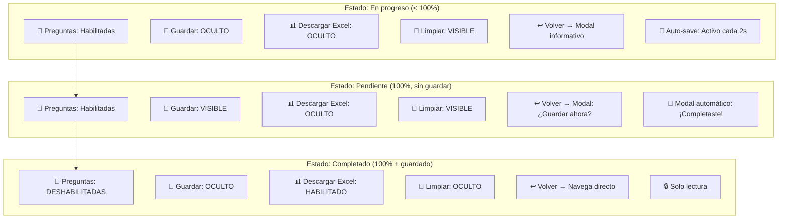
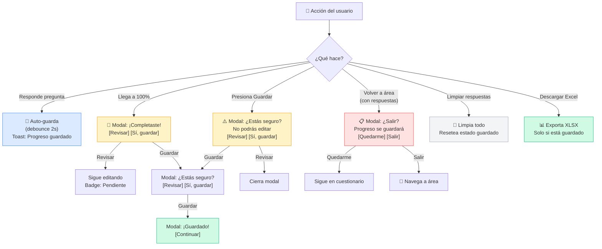
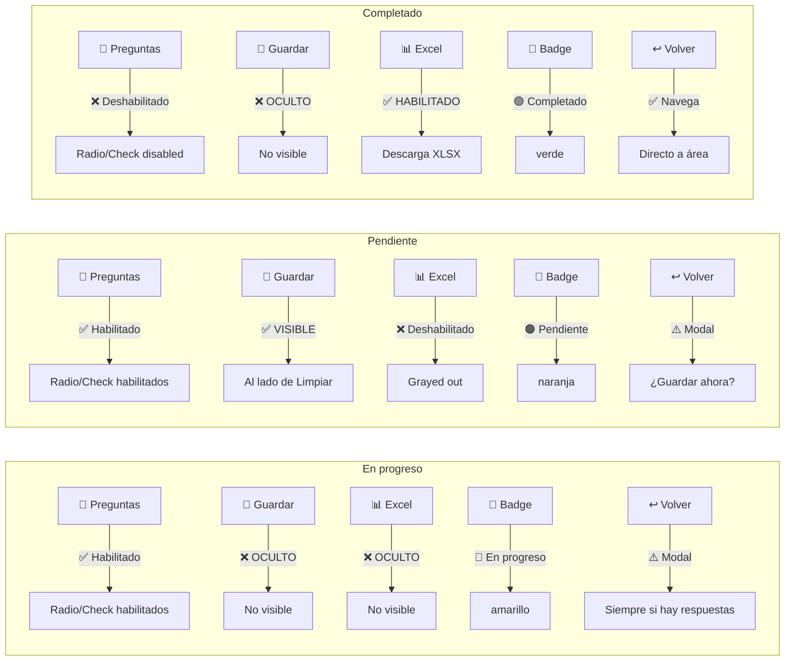
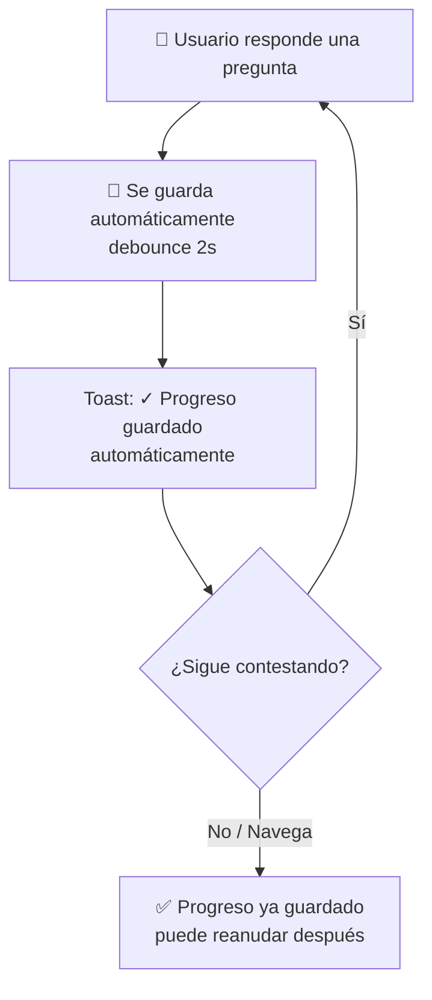
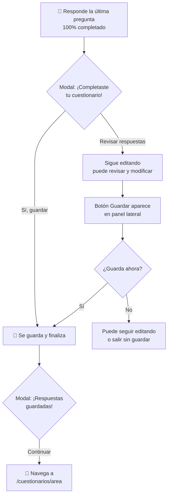
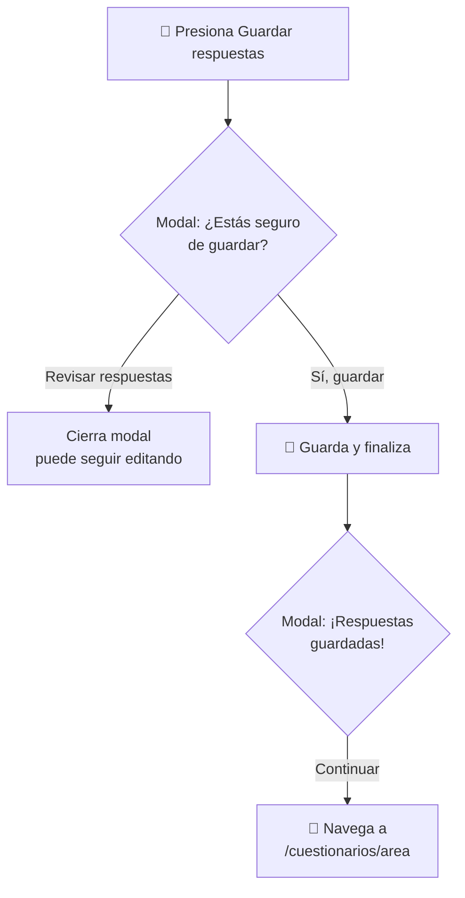
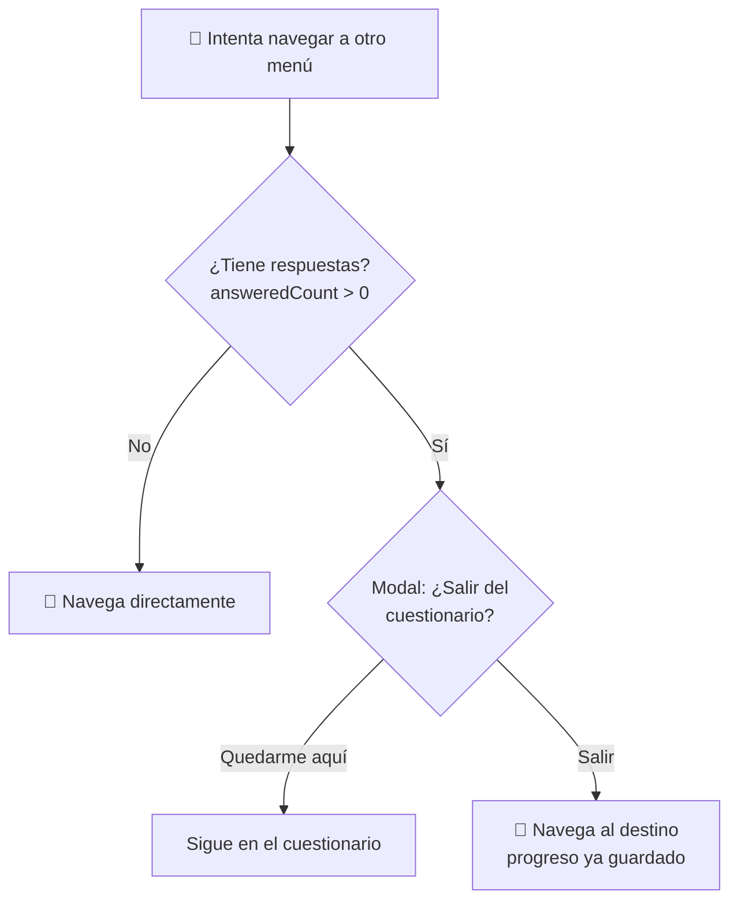
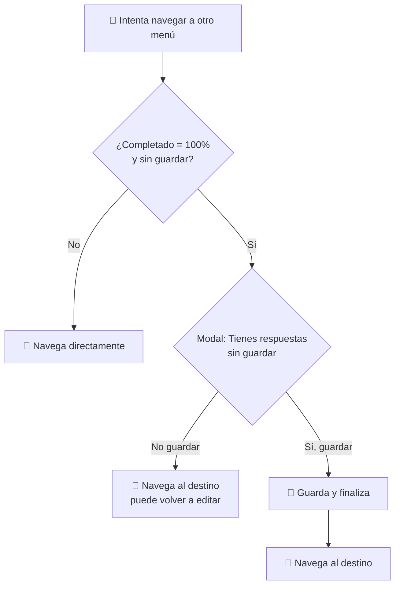
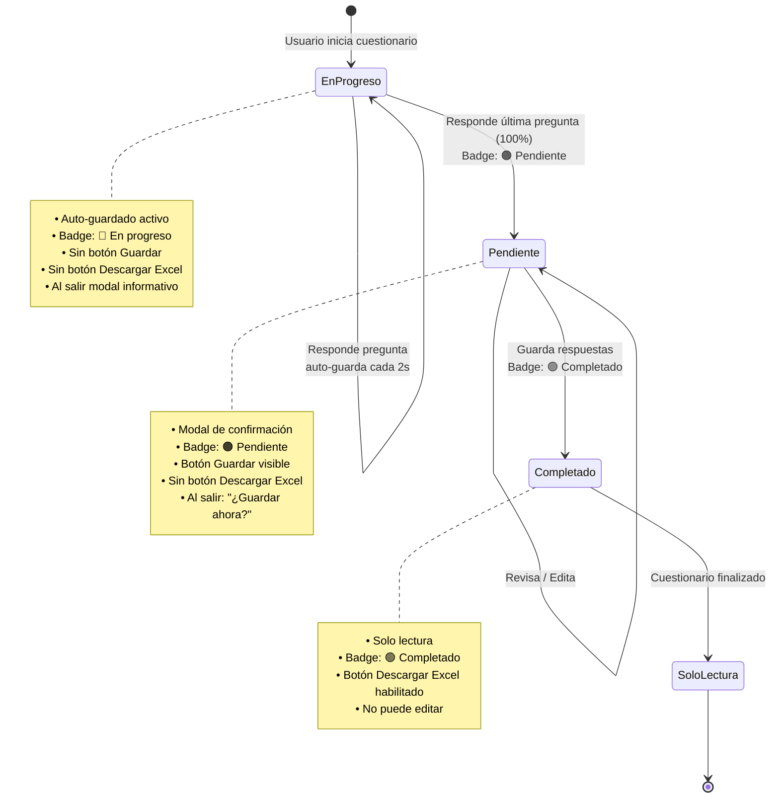

# Reglas de Comportamiento — Cuestionarios

> Comportamiento esperado de modales, auto-guardado, exportación y bloqueo de edición.

---

## Diagrama de botones y modales por estado



---

## Diagrama de modales por evento



---

## Diagrama de habilitado/deshabilitado por estado



## Estados de un Cuestionario

| Estado | Condición | Badge | ¿Se puede editar? | Botón Guardar | Botón Descargar Excel |
|--------|-----------|-------|-------------------|---------------|----------------------|
| **En progreso** | < 100% respondido | 🔵 `En progreso` | ✅ Sí | ❌ Oculto | ❌ Oculto |
| **Pendiente** | 100% respondido, sin confirmar | 🟠 `Pendiente` | ✅ Sí | ✅ Visible | ❌ Oculto |
| **Completado** | 100% + guardado | 🟢 `Completado` | ❌ Solo lectura | ❌ Oculto | ✅ Visible |

### Badges visuales en las cards

Las cards de cuestionarios en `/cuestionarios/{area}` muestran un badge de estado:

- **`Completado`** → fondo verde `rgba(34, 197, 94, 0.15)`, texto `#166534`
- **`Pendiente`** → fondo naranja `rgba(251, 146, 60, 0.15)`, texto `#c2410c`
- **`En progreso`** → fondo amarillo `rgba(251, 191, 36, 0.15)`, texto `#b45309`
- **`No iniciado`** → fondo gris `rgba(148, 163, 184, 0.15)`, texto `#64748b`
- **`Bloqueado`** → fondo gris oscuro, opacity reducida

---

## Auto-guardado (en progreso)



**Reglas:**
- **Cada respuesta** se guarda en localStorage automáticamente.
- Si el usuario cierra la pestaña o navega a otro menú → **no pregunta nada** (ya se guardó).
- Al volver, retoma desde donde se quedó.
- **No aparece** el botón "Guardar respuestas" ni "Descargar Excel" mientras no esté al 100%.

---

## Al completar el 100% (aún sin guardar)



### Mockup del modal de completado

```
┌─────────────────────────────────────────┐
│  🎉 ¡Completaste tu cuestionario!       │
│                                         │
│  Has respondido todas las preguntas.     │
│  ¿Deseas guardar tus respuestas ahora?  │
│                                         │
│  [Revisar respuestas]  [Sí, guardar]    │
└─────────────────────────────────────────┘
```

---

## Botón "Guardar respuestas" (solo al 100%)

**Visible SOLO cuando:**
- `percent === 100`
- `answeredCount > 0`
- Aún no se ha guardado (no completado)



### Mockup del modal de confirmar guardar

```
┌─────────────────────────────────────────┐
│  ⚠️ ¿Estás seguro de guardar?           │
│                                         │
│  Al guardar, no podrás editar este      │
│  cuestionario nuevamente.               │
│                                         │
│  Respondiste X de Y preguntas (100%).   │
│                                         │
│  [Revisar respuestas]  [Sí, guardar]    │
└─────────────────────────────────────────┘
```

---

## Al intentar salir sin haber completado el 100%



**Reglas:**
- **Siempre** muestra el modal si `answeredCount > 0 && !completado` (incluso si el auto-save ya corrió).
- No se pierde ningún progreso (auto-guardado).
- El usuario puede volver a entrar y continuar desde donde se quedó.

### Mockup del modal de salir

```
┌─────────────────────────────────────────┐
│  📋 ¿Salir del cuestionario?            │
│                                         │
│  Tu progreso se guardará automáticamente│
│  y podrás reanudar cuando quieras.      │
│                                         │
│  [Quedarme aquí]  [Salir]               │
└─────────────────────────────────────────┘
```

---

## Al intentar salir habiendo completado el 100% (sin guardar)



### Mockup del modal de salir con 100%

```
┌─────────────────────────────────────────┐
│  ⚠️ Tienes respuestas sin guardar        │
│                                         │
│  Completaste el cuestionario pero aún   │
│  no lo has guardado. ¿Deseas guardarlo  │
│  ahora?                                 │
│                                         │
│  Si no guardas, podrás volver a editar  │
│  tus respuestas más tarde.              │
│                                         │
│  [No guardar]  [Sí, guardar]            │
└─────────────────────────────────────────┘
```

---

## Flujo completo de estados



---

## Descarga de Excel / ZIP

| Botón | Dónde | Condición | ¿Qué descarga? |
|-------|-------|-----------|----------------|
| **Descargar Excel** | Dentro del cuestionario | `percent === 100 && !completado` | Solo ese cuestionario |
| **Descargar Excel** | En el área (`/cuestionarios/{area}`) | Solo cuestionarios al 100% | Cuestionarios completados del área |
| **Descargar todo (ZIP)** | Vista principal (`/cuestionarios`) | Solo cuestionarios al 100% | Un .xlsx por cada área con completados |

### Regla general de exportación

> **Solo se exportan cuestionarios al 100% completados y guardados.**  
> Los cuestionarios en progreso **nunca** se incluyen en descargas.

```mermaid
flowchart LR
    subgraph Cuestionario
        A[Verificar percent] --> B{¿100%?}
        B -->|No| C[❌ No exportable]
        B -->|Sí| D[✅ Exportable]
    end
    
    subgraph "Descarga individual"
        D --> E[Botón Descargar Excel<br/>en panel lateral]
    end
    
    subgraph "Descarga por área"
        D --> F[Botón Descargar Excel<br/>en /cuestionarios/area]
    end
    
    subgraph "Descarga ZIP global"
        D --> G[Botón Descargar todo (ZIP)<br/>en /cuestionarios]
    end
```

---

## Resumen de Modales

| Evento | Modal | Acciones |
|--------|-------|----------|
| Completar 100% | "¡Completaste tu cuestionario!" | Revisar / Guardar |
| Guardar (100%) | "¿Estás seguro de guardar?" | Revisar / Guardar |
| Guardado exitoso | "¡Respuestas guardadas!" | Continuar |
| Salir con progreso (< 100%) | "¿Salir del cuestionario?" | Quedarme / Salir |
| Salir con 100% sin guardar | "Tienes respuestas sin guardar" | No guardar / Guardar |
| Volver desde cuestionario con respuestas | "¿Salir del cuestionario?" | Quedarme / Salir |

**Nota:** El botón "Volver a {área}" **siempre** muestra el modal si `answeredCount > 0 && !completado`.

**Todos los modales usan glassmorfismo** (componente `ModalGlass`).

---

## Archivos relacionados

| Archivo | Responsabilidad |
|---------|----------------|
| `src/pages/Cuestionarios/PlantillaQs.jsx` | Lógica de auto-guardado, modales, solo lectura |
| `src/pages/Cuestionarios/PreguntasQs.jsx` | Renderizado de preguntas (solo lectura) |
| `src/pages/Cuestionarios/Run.jsx` | Carga cuestionario y pasa `forceArea` |
| `src/components/ModalGlass/ModalGlass.jsx` | Componente reutilizable de modal |
| `src/pages/Cuestionarios/Area.jsx` | Vista de área, badges de estado, descarga Excel |
| `src/pages/Cuestionarios/Cuestionarios.jsx` | Vista principal, métricas globales, descarga ZIP |
| `src/pages/Cuestionarios/area.module.css` | Estilos de badges (`.completado`, `.pendiente`, etc.) |
| `src/components/Tarjetas/TarjetaCuestionarios/TrjEstadoCuestionario.jsx` | Badge de estado por cuestionario |
| `src/components/Tarjetas/TarjetaCuestionarios/trjEstadoCuestionario.module.css` | Estilos de badges con `data-estado` |
| `src/utils/progreso.js` | `getProgressSummary()` lee `:guardado`, `progressState()` distingue estados |
| `src/utils/exportarExcel.js` | Lógica de exportación Excel/ZIP |
| `src/utils/logicPreg.js` | `storageKeyFor()` usa `key > id > name` para consistencia |
