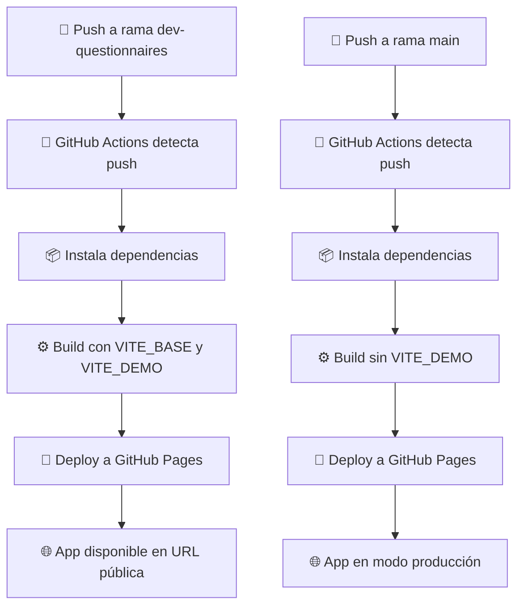

# Feature: Workflow de GitHub Pages y Modo Demo para Despliegue

> **Estado: Implementado (19 ago 2026).** Se creó un workflow de GitHub Actions 
> que despliega automáticamente el frontend a GitHub Pages en cada push a la 
> rama `dev-questionnaires`. El workflow detecta el nombre del repositorio 
> para configurar `VITE_BASE` y activa el modo demo en ramas que no son `main`.

## Objetivo

Permitir la demostración pública de la plataforma Libersalus sin necesidad de 
servidores dedicados, facilitando accesos para stakeholders, clientes potenciales 
y pruebas internas mediante GitHub Pages.

## Configuración del Workflow

### Archivo: `.github/workflows/deploy.yml`

```yaml
name: Build & Deploy — Frontend

on:
  push:
    branches:
      - dev-questionnaires

permissions:
  contents: write

jobs:
  build:
    runs-on: ubuntu-latest
    
    steps:
      - name: Checkout code
        uses: actions/checkout@v4

      - name: Setup Node.js
        uses: actions/setup-node@v4
        with:
          node-version: '20'
          cache: 'npm'
          cache-dependency-path: lsinciosesionweb/package-lock.json

      - name: Install dependencies
        working-directory: lsinciosesionweb
        run: npm ci

      - name: Build project
        working-directory: lsinciosesionweb
        run: npm run build
        env:
          VITE_BASE: /${{ github.event.repository.name }}/
          VITE_DEMO: ${{ github.ref_name != 'main' && 'true' || 'false' }}

      - name: Deploy to GitHub Pages
        uses: peaceiris/actions-gh-pages@v3
        with:
          github_token: ${{ secrets.GITHUB_TOKEN }}
          publish_dir: ./lsinciosesionweb/dist
```

### Variables de Entorno

| Variable | Descripción | Ejemplo |
|----------|-------------|---------|
| `VITE_BASE` | Ruta base de la app (detectada del nombre del repo) | `/dashboard/` |
| `VITE_DEMO` | Activa modo demo en ramas que no son `main` | `true` o `false` |

### Comportamiento por Rama

| Rama | `VITE_DEMO` | Modo | URL Resultante |
|------|-------------|------|----------------|
| `main` | `false` | Producción | `libersalus.github.io/{repo}/` |
| `dev-questionnaires` | `true` | Demo | `libersalus.github.io/{repo}/` |

## Configuración del Router

El router de React Router usa `VITE_BASE` para el `basename`:

```jsx
// src/routes/index.jsx
const base = import.meta.env.VITE_BASE || "/";
const basename = base.endsWith("/") ? base.slice(0, -1) : base;

<BrowserRouter basename={basename}>
  {/* ... */}
</BrowserRouter>
```

### URLs Resultantes

| Repo | `VITE_BASE` | URL Login | URL Inicio |
|------|-------------|-----------|------------|
| `dashboard` | `/dashboard/` | `libersalus.github.io/dashboard/login` | `libersalus.github.io/dashboard/inicio` |
| `registro` | `/registro/` | `libersalus.github.io/registro/login` | `libersalus.github.io/registro/inicio` |

## Modo Demo en GitHub Pages

Cuando `VITE_DEMO=true`, la app muestra:

1. **Botón "Iniciar demo"** en la pantalla de login
2. **Modal de selección** con 3 opciones:
   - Perfil de prueba (acceso rápido)
   - Iniciar sesión (con cuenta demo)
   - Crear cuenta (registro persistente)
3. **Selector de persona** con 4 perfiles:
   - María (34 años, adulto activo)
   - Juan (50 años, adulto activo)
   - Rosa (68 años, mayor asistido)
   - Sofía (10 años, menor)

## Flujo de Despliegue



## Prerrequisitos

1. **Repositorio GitHub** con Pages habilitado:
   - Settings → Pages → Source: **gh-pages branch**

2. **Secret `GITHUB_TOKEN`**:
   - Ya disponible por defecto en GitHub Actions

3. **Estructura del repo**:
   ```
   projects_frontend/          ← repo raíz
   ├── .github/workflows/
   │   └── deploy.yml          ← workflow aquí
   ├── lsinciosesionweb/       ← proyecto frontend
   │   ├── src/
   │   ├── package.json
   │   └── dist/               ← build output
   └── ...
   ```

## Troubleshooting

### Error 404 en assets

**Causa**: `VITE_BASE` no coincide con la URL de GitHub Pages.

**Solución**: Verificar que `VITE_BASE` sea `/{nombre-repo}/` (con barras).

### Router no encuentra rutas

**Causa**: `basename` del router no coincide con la URL.

**Solución**: Verificar que `import.meta.env.VITE_BASE` esté configurado.

### Build falla en GitHub Actions

**Causa**: Falta instalar dependencias o `working-directory` incorrecto.

**Solución**: Verificar que `npm ci` se ejecute en la carpeta correcta.

## Archivos Relacionados

| Archivo | Responsabilidad |
|---------|----------------|
| `.github/workflows/deploy.yml` | Workflow de GitHub Actions |
| `src/routes/index.jsx` | Router con `basename` dinámico |
| `vite.config.js` | Configuración de Vite con `VITE_BASE` |
| `.env` | Variables de entorno locales |
| `src/features/autenticacion/vistas/ModalDemoHub.jsx` | Modal de selección de demo |
| `src/features/autenticacion/vistas/VistaSeleccionDemo.jsx` | Selector de persona demo |
