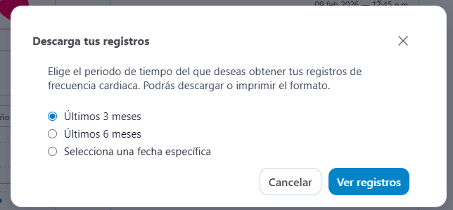
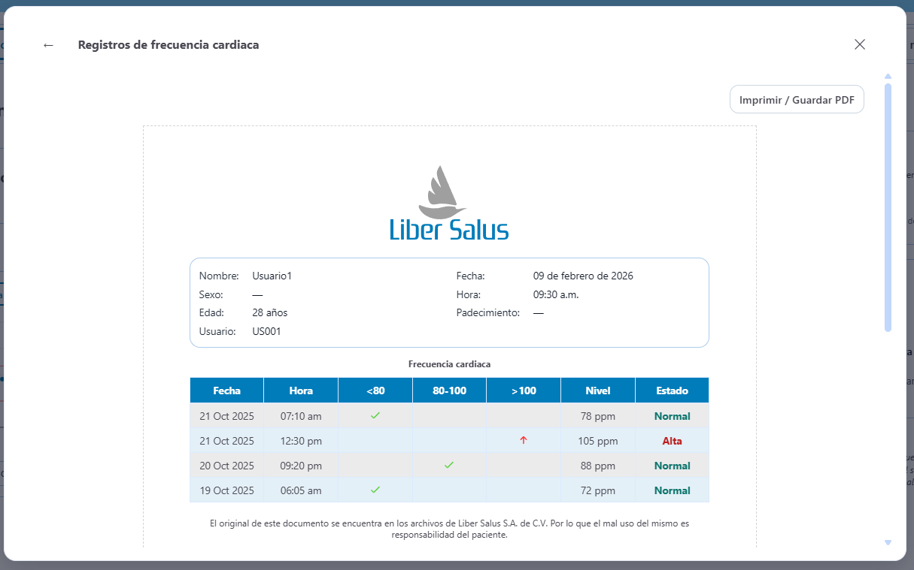
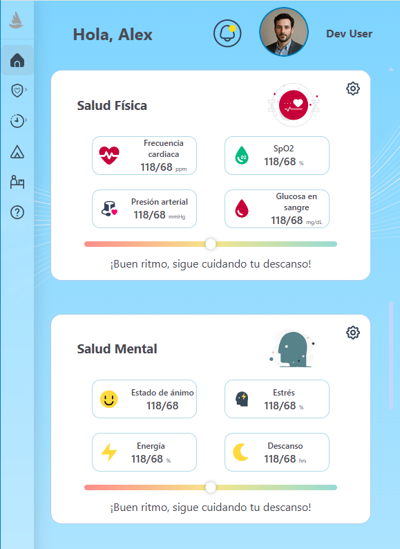
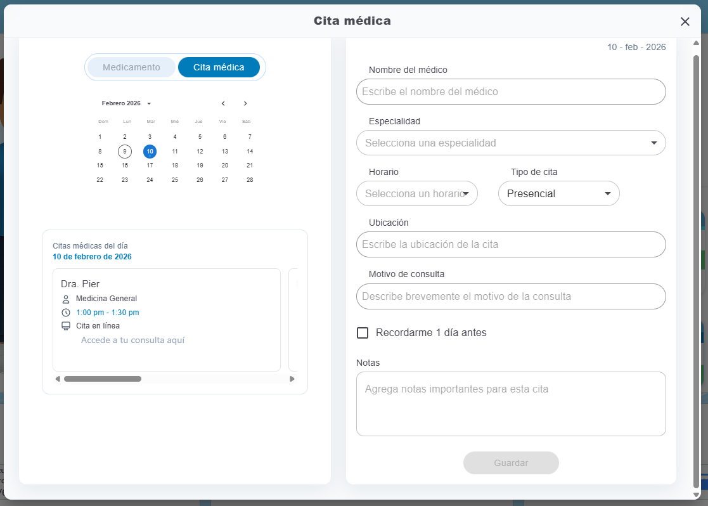
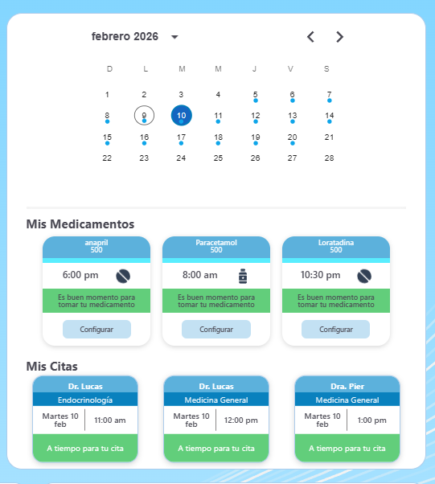
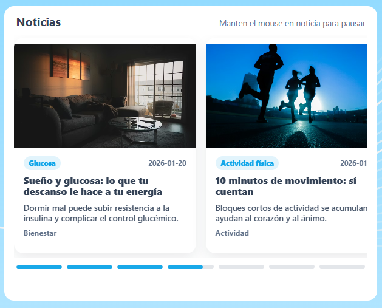

# Reporte de Cambios - Enero 2026

## Periodo analizado
- Desde: 2026-01-01
- Hasta: 2026-01-31
- Fuente: historial de git del repositorio `lsinciosesionweb`

## Resumen
- Commits registrados: 25
- Archivos impactados (acumulado): 283
- Inserciones: 10,484
- Eliminaciones: 3,621

Durante enero se concentraron mejoras en tres frentes: diseño responsivo de vistas clave, evolución del módulo de citas/calendario y fortalecimiento de módulos de métricas/medicamentos/noticias.

## Lista de actividades realizadas
1. Implementación y ajuste de modales en varias vistas.
   Se estandarizó la apertura/cierre y el contenido de ventanas modales para formularios y flujos informativos, mejorando consistencia visual y de interacción.
   
2. Mejoras visuales de fondo/impresiones y ajustes generales de interfaz.
   Se aplicaron cambios de estilo global para reforzar legibilidad y presentación de componentes, incluyendo acabados visuales en pantallas principales. Se mantiene pendiente el diseño de reportes para impresión.
   
3. Ajustes responsivos en tarjetas de inicio y validación de estilos en métricas.
   Se corrigieron desbordes, alineaciones y distribución de tarjetas para que la vista de inicio y el panel de métricas se adapten mejor a móviles y tabletas.
   Se mantiene pendiente, las modificaciones requridas para las gráficas de metricas.
4. Implementación de modos responsivos del inicio (iteraciones 1 a 3).
   Se desarrollaron varias iteraciones de layout responsive en la pantalla de inicio, afinando tamaños, separación de bloques y jerarquía visual.
5. Validación de márgenes y comportamiento responsive en distintas resoluciones.
   Se revisó el espaciado horizontal/vertical en breakpoints críticos para evitar saltos de diseño y pérdida de legibilidad.
   
6. Refactor y ajuste de estilos de gráficas en el módulo de métricas.
   Se reorganizaron estilos y presentación de gráficas para mejorar claridad de datos y coherencia con el diseño general del sistema.
7. Ajustes responsive en vista física y oxigenación.
   Se optimizó la estructura visual de estas vistas para mantener lectura correcta de tarjetas, textos y controles en pantallas reducidas.
8. Implementación de vista responsiva para oxigenación.
   Se incorporó comportamiento adaptativo específico para la sección de oxigenación, priorizando visibilidad de indicadores principales.
9. Ajustes responsive en frecuencia y glucosa.
   Se ajustaron componentes de captura y visualización para que frecuencia y glucosa funcionen de forma estable en distintos anchos de pantalla.
10. Mejoras en modal de recordatorios (incluyendo selector de días).
    Se añadió y ajustó el selector de días dentro del modal para definir recordatorios de forma más clara y precisa para el usuario.
11. Ajustes responsive para presión.
    Se realizaron correcciones de layout y espaciado en la sección de presión para mantener consistencia con otros módulos de métricas.
12. Ajustes del calendario en inicio con foco en rangos intermedios de pantalla.
    Se optimizó la visualización del calendario en resoluciones aproximadas entre 420 y 760 px para evitar solapamientos y recortes.
13. Habilitación para agendar citas y pintar tarjetas en panel inicial.
    Se conectó el flujo de agendamiento con la representación visual en inicio, mostrando tarjetas de citas programadas en el panel principal.
    
14. Implementación de citas reales en calendario, modal responsive y tarjetas en panel.
    Se consolidó la integración de datos de citas en calendario, ajustando además la experiencia responsive del modal y sus tarjetas asociadas.
    
15. Habilitación de tarjetas de citas clickeables.
    Se incorporó interacción directa sobre tarjetas para abrir detalles o ejecutar acciones relacionadas con la cita.

16. Mejora de tarjeta/modal de noticias y activación de carrusel.
    Se ajustó la experiencia de lectura de noticias con tarjeta y modal, habilitando estados activos de navegación en carrusel.
    
17. Implementación y mejoras del carrusel de noticias.
    Se añadieron ajustes funcionales y visuales del carrusel para mejorar recorrido de contenidos y percepción de continuidad.
18. Inclusión de referencias máximas/mínimas pendientes en glucosa.
    Se incorporaron parámetros de referencia para glucosa con el fin de apoyar interpretación de valores dentro de rangos esperados.
19. Ajustes de dependencias y mejoras en formulario de medicamentos.
    Se actualizaron configuraciones del proyecto y se fortaleció el formulario de medicamentos para mejorar estabilidad y captura de datos.
20. Mejora de modal de cita médica (valor D).
    Se ajustó la lógica/interfaz del modal de cita médica relacionada con el campo o parámetro denominado valor D.
21. Guardado de medicamentos en calendario de tratamientos por fecha según configuración.
    Se implementó persistencia de tratamientos por fecha, permitiendo registrar y visualizar medicamentos conforme a la configuración definida.

## Trazabilidad de commits (enero 2026)
- 2026-01-30 - `bbdfd8d` - add// medicamentos. guarda en calendario tratamientos por fecha según configuración
- 2026-01-29 - `a3d5ae9` - valor D modalCitaMedica
- 2026-01-28 - `c0f0e48` - add// ajuste package, monos3d, formulario medicamento..
- 2026-01-27 - `6046d15` - Noticias carru
- 2026-01-27 - `8d4dbf1` - referencias max min pendiente glucosa..
- 2026-01-26 - `126223e` - modal tarjeta noticia hacer activo carrusel
- 2026-01-26 - `b14d54a` - Tarjetas citas clikeables
- 2026-01-26 - `38db977` - feat(calendario): citas reales + modal responsive + tarjetas en panel
- 2026-01-26 - `94bbb22` - agendar citas y pintar tarjetas en panel inicial
- 2026-01-23 - `110a3bf` - ajuste de calendario en inicio, pendiente responsive en 420 - 760
- 2026-01-22 - `067802a` - responsive presion
- 2026-01-21 - `60156b5` - 3
- 2026-01-21 - `37d5863` - Responsive Glucosa pendiente selector de días en modal de recordatorios.
- 2026-01-21 - `9e236b5` - respon frecuencia
- 2026-01-21 - `6de118f` - 2
- 2026-01-21 - `4f23a16` - 1
- 2026-01-21 - `ba1861e` - vista responsiva oxigenación
- 2026-01-20 - `5d2bff5` - responsive vista física oxigenación pendiente
- 2026-01-20 - `be9243e` - 1
- 2026-01-20 - `e2f601c` - estilos de graficas en metricas
- 2026-01-16 - `0fc2de5` - validar respon margenes
- 2026-01-15 - `de0a0a5` - modos responsivos inicio 1-3
- 2026-01-14 - `db85408` - modo responsivo en tarjetas inicio.. validar estilos en metricas.
- 2026-01-13 - `3a23059` - impresiones backgr
- 2026-01-12 - `a8215bd` - modales

## Notas
- Las graficas se mantienen en construcción para ajustarlas a las necesidades propuestas por el área de investigación
- Las vistas responsivas se mantienen en construcción para ajustarlas a diseño propuesto.
- El reporte describe cambios técnicos integrados al repositorio durante enero 2026. 
